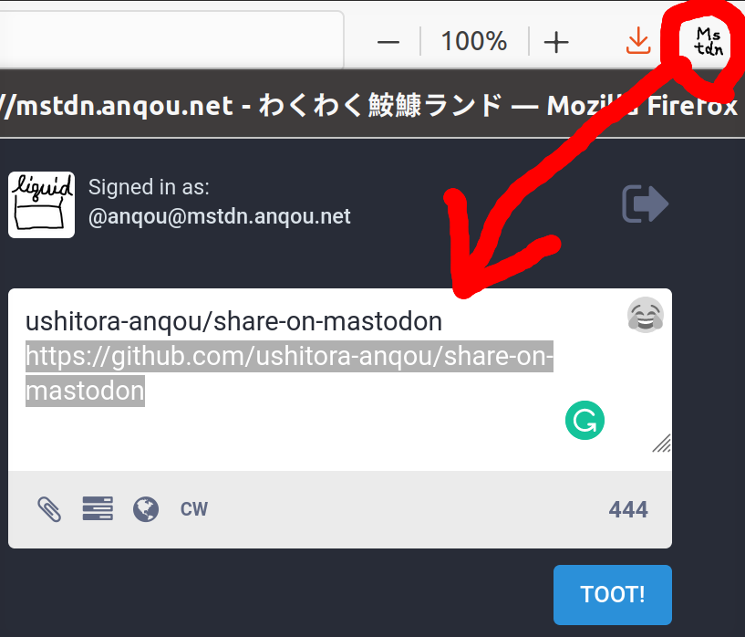

# Share on Mastodon

[Add-on page on addons.mozilla.org](https://addons.mozilla.org/en-US/firefox/addon/share-on-mastodon/) and [official website](http://anqou.net/share-on-mastodon/).

[**Share on Mastodon**](https://addons.mozilla.org/en-US/firefox/addon/share-on-mastodon/) is yet another Firefox add-on to post your favorite Web page on Mastodon with just one click.

## How to Use

1. Install this add-on.
2. Set the domain of your Mastodon server in the Firefox add-on setting page.
3. Push the "Mstdn" button to post your favorite Web page.

Enjoy :)
